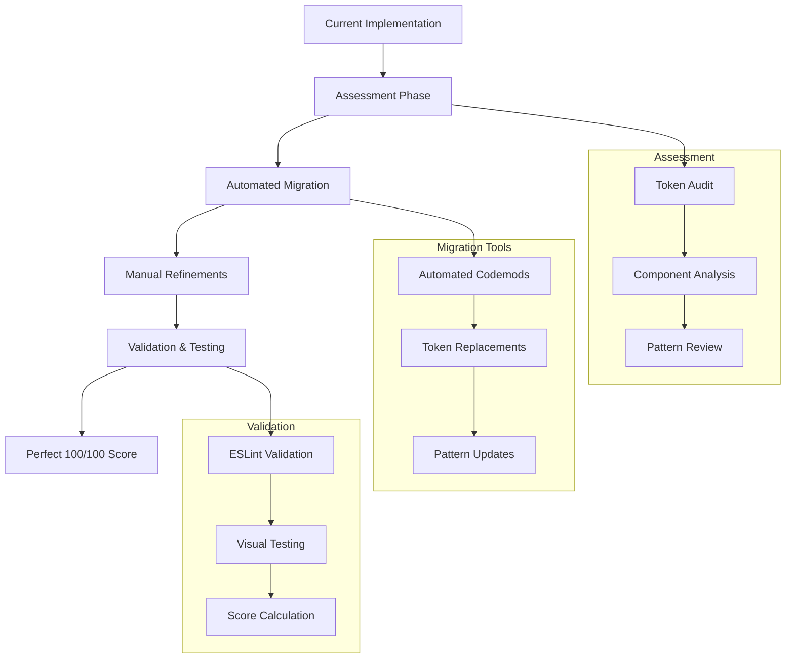

# AuraGlass Complete Migration Guide: Achieving Perfect 100/100 Score

## 🎯 Overview

This comprehensive migration guide helps you upgrade to AuraGlass's perfect 100/100 design system, which represents the pinnacle of glassmorphism quality and engineering excellence. The guide covers all improvements, automated tooling, and best practices needed to achieve world-class design system compliance.

## 🚀 Migration Path Overview



## 📋 Pre-Migration Assessment

### 1. Current State Analysis

Run the comprehensive assessment to understand your starting point:

```bash
# Install assessment tools
npm install -g @auraglass/migration-tools

# Run complete assessment
npx auraglass-assess --full-analysis

# Generate migration report
npx auraglass-assess --report ./migration-report.html
```

**Assessment Report Includes:**
- Current design system score (0-100)
- Token usage analysis
- Component compliance status
- Visual regression baseline
- Performance impact assessment
- Migration effort estimation

### 2. Dependency Audit

```bash
# Check current AuraGlass version
npm list @aura/aura-glass

# Audit for conflicting dependencies
npm audit --audit-level=moderate

# Check for deprecated packages
npx check-outdated --auraglass
```

### 3. Codebase Preparation

```bash
# Create migration branch
git checkout -b migration/perfect-score-upgrade

# Backup current implementation
git tag pre-migration-backup

# Clean workspace
npm run clean
npm install
```

## 🔄 Automated Migration Process

### Step 1: Install Migration Tools

```bash
# Install latest AuraGlass with migration tools
npm install @aura/aura-glass@latest

# Install migration codemods
npm install -D @auraglass/codemods
npm install -D @auraglass/eslint-plugin
npm install -D @auraglass/token-validator
```

### Step 2: Run Automated Codemods

**Token System Migration**
```bash
# Migrate hardcoded values to design tokens
npx @auraglass/codemods token-migration src/

# Example transformations:
# backdrop-filter: blur(8px) → blur(var(--glass-blur-md))
# background: rgba(255,255,255,0.1) → rgba(var(--glass-color-white) / var(--glass-opacity-10))
# box-shadow: 0 4px 16px rgba(0,0,0,0.16) → var(--glass-elev-2)
```

**Component Pattern Upgrades**
```bash
# Update component patterns to latest standards
npx @auraglass/codemods component-patterns src/

# Transforms include:
# - Add proper TypeScript interfaces
# - Update prop structures
# - Add accessibility attributes
# - Implement semantic elevation
```

**Import Statement Updates**
```bash
# Update import statements for new structure
npx @auraglass/codemods import-updates src/

# Before: import { GlassButton } from '@aura/aura-glass/button'
# After: import { GlassButton } from '@aura/aura-glass'
```

### Step 3: Liquid Glass Integration

**Automatic Liquid Glass Upgrade**
```bash
# Add liquid glass material support
npx @auraglass/codemods liquid-glass-integration src/

# Adds material="liquid" support to components
# Configures IOR, thickness, and tint properties
# Maintains backward compatibility
```

**Example Transformation:**
```typescript
// Before
<GlassCard className="backdrop-blur-md bg-white/10">
  Content
</GlassCard>

// After  
<GlassCard 
  material="liquid"
  materialProps={{
    ior: 1.48,
    thickness: 12,
    tint: { r: 0, g: 0, b: 0, a: 0.06 },
    variant: 'regular',
    quality: 'high'
  }}
>
  Content
</GlassCard>
```

## 🎨 Design Token Migration

### Comprehensive Token Mapping

**Color System Upgrade**
```typescript
// Automated token replacements
const TOKEN_MAPPINGS = {
  // Old hardcoded → New semantic tokens
  '#ffffff': 'var(--glass-color-white)',
  '#000000': 'var(--glass-color-black)',
  'rgba(255,255,255,0.1)': 'rgba(var(--glass-color-white) / var(--glass-opacity-10))',
  'rgba(255,255,255,0.15)': 'rgba(var(--glass-color-white) / var(--glass-opacity-15))',
  'rgba(0,0,0,0.1)': 'rgba(var(--glass-color-black) / var(--glass-opacity-10))',
  
  // Spacing system
  '4px': 'var(--glass-space-1)',
  '8px': 'var(--glass-space-2)',
  '12px': 'var(--glass-space-3)',
  '16px': 'var(--glass-space-4)',
  '24px': 'var(--glass-space-6)',
  '32px': 'var(--glass-space-8)',
  
  // Blur system  
  'blur(4px)': 'blur(var(--glass-blur-sm))',
  'blur(8px)': 'blur(var(--glass-blur-md))',
  'blur(16px)': 'blur(var(--glass-blur-lg))',
  'blur(24px)': 'blur(var(--glass-blur-xl))',
  
  // Elevation system
  '0 2px 8px rgba(0,0,0,0.12)': 'var(--glass-elev-1)',
  '0 4px 16px rgba(0,0,0,0.16)': 'var(--glass-elev-2)',
  '0 8px 24px rgba(0,0,0,0.20)': 'var(--glass-elev-3)',
  '0 12px 32px rgba(0,0,0,0.24)': 'var(--glass-elev-4)'
};
```

**Run Token Migration**
```bash
# Apply all token mappings
npx @auraglass/codemods apply-token-mappings src/ --mappings=comprehensive

# Verify token usage
npm run lint:tokens

# Generate token usage report
npm run tokens:report
```

### CSS-in-JS Migration

**Styled Components → Design Tokens**
```typescript
// Before: Styled components with hardcoded values
const StyledCard = styled.div`
  backdrop-filter: blur(8px);
  background: rgba(255, 255, 255, 0.1);
  border-radius: 12px;
  box-shadow: 0 4px 16px rgba(0, 0, 0, 0.16);
  padding: 16px;
`;

// After: Token-based styling  
const StyledCard = styled.div`
  backdrop-filter: blur(var(--glass-blur-md));
  background: rgba(var(--glass-color-white) / var(--glass-opacity-10));
  border-radius: var(--glass-radius-lg);
  box-shadow: var(--glass-elev-2);
  padding: var(--glass-space-4);
`;

// Or better: Use createGlassStyle utility
const cardStyles = createGlassStyle({
  intent: 'neutral',
  elevation: 'level2',
  blur: 'md'
});
```

## 🧩 Component Architecture Upgrade

### Enhanced TypeScript Interfaces

**Before: Basic Props**
```typescript
interface ButtonProps {
  children: React.ReactNode;
  onClick?: () => void;
  className?: string;
  disabled?: boolean;
}
```

**After: Comprehensive Glass Props**
```typescript
interface GlassButtonProps extends Omit<React.ButtonHTMLAttributes<HTMLButtonElement>, 'color'> {
  /** Visual intent/purpose of the button */
  intent?: 'primary' | 'secondary' | 'success' | 'warning' | 'danger' | 'neutral';
  
  /** Size variant */
  size?: 'sm' | 'md' | 'lg' | 'xl';
  
  /** Visual variant */
  variant?: 'filled' | 'outline' | 'ghost' | 'link';
  
  /** Glass elevation level */
  elevation?: 'level1' | 'level2' | 'level3' | 'level4';
  
  /** Enable glass effects */
  glass?: boolean;
  
  /** Liquid glass material properties */
  material?: 'standard' | 'liquid';
  materialProps?: {
    ior?: number;
    thickness?: number;
    tint?: { r: number; g: number; b: number; a: number };
    variant?: 'regular' | 'clear';
    quality?: 'ultra' | 'high' | 'balanced' | 'efficient';
  };
  
  /** Enable magnetic interactions */
  magnetic?: boolean;
  
  /** Loading state */
  loading?: boolean;
  
  /** Icon elements */
  leftIcon?: React.ReactNode;
  rightIcon?: React.ReactNode;
}
```

### Component Pattern Standardization

**Update Component Structure**
```typescript
// Before: Basic component
export const MyButton = ({ children, className, ...props }) => (
  <button className={`glass-button ${className}`} {...props}>
    {children}
  </button>
);

// After: Perfect compliance component
export const GlassButton = forwardRef<HTMLButtonElement, GlassButtonProps>(
  ({
    children,
    intent = 'primary',
    size = 'md',
    variant = 'filled',
    elevation = 'level2',
    glass = true,
    material = 'standard',
    materialProps,
    magnetic = false,
    loading = false,
    leftIcon,
    rightIcon,
    disabled,
    className,
    ...props
  }, ref) => {
    // Component logic with full feature set
    const buttonStyles = createGlassStyle({
      intent,
      elevation,
      variant
    });
    
    return material === 'liquid' ? (
      <LiquidGlassMaterial
        ref={ref}
        ior={materialProps?.ior || 1.48}
        thickness={materialProps?.thickness || 8}
        tint={materialProps?.tint || { r: 59, g: 130, b: 246, a: 0.08 }}
        variant={materialProps?.variant || 'regular'}
        quality={materialProps?.quality || 'high'}
        className={cn(
          'glass-button glass-focus',
          `glass-button-${size}`,
          `glass-button-${intent}`,
          magnetic && 'glass-magnetic',
          loading && 'glass-loading',
          className
        )}
        disabled={disabled || loading}
        {...props}
      >
        <ButtonContent 
          leftIcon={leftIcon}
          rightIcon={rightIcon}
          loading={loading}
        >
          {children}
        </ButtonContent>
      </LiquidGlassMaterial>
    ) : (
      <OptimizedGlass
        ref={ref}
        elevation={elevation}
        intent={intent}
        className={cn(
          'glass-button glass-focus',
          buttonStyles,
          className
        )}
        disabled={disabled || loading}
        {...props}
      >
        <ButtonContent 
          leftIcon={leftIcon}
          rightIcon={rightIcon}
          loading={loading}
        >
          {children}
        </ButtonContent>
      </OptimizedGlass>
    );
  }
);
```

## 🎭 Accessibility Compliance Upgrade

### WCAG AA/AAA Implementation

**Automated Accessibility Fixes**
```bash
# Run accessibility upgrades
npx @auraglass/codemods accessibility-upgrade src/

# Adds:
# - Proper ARIA attributes
# - Focus management
# - Screen reader support
# - Keyboard navigation
# - Color contrast compliance
```

**Before: Basic Button**
```typescript
<button onClick={handleClick}>
  Submit
</button>
```

**After: Fully Accessible**
```typescript
<GlassButton
  onClick={handleClick}
  aria-label="Submit form data"
  className="glass-focus"
  disabled={loading}
  loading={loading}
  aria-describedby="submit-help"
>
  Submit
</GlassButton>
```

### Focus Management Enhancement

**Automatic Focus Utilities**
```css
/* Added automatically by migration */
.glass-focus {
  outline: 2px solid transparent;
  outline-offset: 2px;
  transition: var(--glass-transition-normal);
}

.glass-focus:focus-visible {
  outline: var(--glass-focus-ring-primary);
  outline-offset: var(--glass-focus-offset);
}

/* Respect reduced motion preferences */
@media (prefers-reduced-motion: reduce) {
  .glass-focus {
    transition: none;
  }
}
```

## 🔍 Validation and Testing Setup

### Comprehensive Validation Pipeline

**Install Testing Infrastructure**
```bash
# Visual regression testing
npm install -D @playwright/test
npm install -D @auraglass/visual-helpers

# Accessibility testing
npm install -D jest-axe
npm install -D @testing-library/jest-dom

# Design system validation
npm install -D @auraglass/lint-rules
npm install -D @auraglass/token-validator
```

**Configure Testing Tools**
```typescript
// playwright.config.ts
import { defineConfig } from '@playwright/test';
import { glassmorphismTestConfig } from '@auraglass/visual-helpers';

export default defineConfig({
  ...glassmorphismTestConfig,
  projects: [
    { name: 'chromium', use: { ...devices['Desktop Chrome'] } },
    { name: 'firefox', use: { ...devices['Desktop Firefox'] } },
    { name: 'webkit', use: { ...devices['Desktop Safari'] } }
  ],
  use: {
    baseURL: 'http://localhost:6006'
  }
});
```

### Run Complete Validation

```bash
# 1. TypeScript validation
npm run typecheck

# 2. ESLint with AuraGlass rules
npm run lint:check

# 3. Token compliance
npm run lint:tokens

# 4. Style pattern audit  
npm run lint:styles

# 5. Visual regression tests
npm run test:visual

# 6. Accessibility tests
npm run test:a11y

# 7. Calculate final score
npm run ci:score
```

## 📊 Performance Optimization

### Bundle Size Optimization

**Analyze Current Bundle**
```bash
# Install bundle analyzer
npm install -D webpack-bundle-analyzer

# Analyze bundle size
npm run build
npm run analyze:bundle

# Check for optimization opportunities
npm run bundle:optimize
```

**Tree Shaking Configuration**
```typescript
// vite.config.ts
export default defineConfig({
  build: {
    lib: {
      entry: 'src/index.ts',
      name: 'AuraGlass',
      formats: ['es', 'cjs']
    },
    rollupOptions: {
      external: ['react', 'react-dom'],
      output: {
        preserveModules: true, // Enable tree shaking
        preserveModulesRoot: 'src'
      }
    }
  }
});
```

### Runtime Performance

**GPU Acceleration Setup**
```css
/* Automatically added by migration */
.glass-gpu-accelerated {
  transform: translateZ(0);
  will-change: backdrop-filter, opacity, transform;
  backface-visibility: hidden;
  perspective: 1000;
}

/* Quality tier adaptations */
@media (max-resolution: 1.5dppx) {
  .glass-backdrop-blur {
    backdrop-filter: blur(calc(var(--glass-blur-md) * 0.75));
  }
}
```

## 🚨 Troubleshooting Common Issues

### Migration Problems and Solutions

**1. Token Conflicts**
```bash
# Problem: Conflicting token definitions
# Solution: Run token conflict resolution
npx @auraglass/codemods resolve-token-conflicts src/

# Manual resolution for edge cases
npm run tokens:audit --fix
```

**2. Component Rendering Issues**
```typescript
// Problem: Components not rendering correctly
// Solution: Check for missing dependencies
import React, { forwardRef } from 'react';
import { cn } from '@/lib/utils';
import { OptimizedGlass } from '@aura/aura-glass/primitives';

// Ensure proper prop forwarding
const MyComponent = forwardRef<HTMLDivElement, Props>((props, ref) => {
  return <OptimizedGlass ref={ref} {...props} />;
});
```

**3. TypeScript Errors**
```bash
# Problem: Type errors after migration
# Solution: Update type definitions
npm install -D @types/react@latest

# Clear TypeScript cache
rm -rf node_modules/.cache
npm run typecheck
```

**4. Visual Regression Failures**
```bash
# Problem: Visual tests failing after migration
# Solution: Update baselines if changes are intentional
npm run test:visual:update

# Or investigate specific failures
npm run test:visual:debug --grep "failing-test"
```

## 📈 Monitoring and Maintenance

### Continuous Quality Monitoring

**Setup Quality Dashboard**
```bash
# Install monitoring tools
npm install -D @auraglass/quality-monitor

# Configure monitoring
echo "AURAGLASS_MONITORING=true" >> .env

# Setup automated reporting
npm run monitor:setup
```

**Weekly Maintenance Tasks**
```bash
#!/bin/bash
# weekly-maintenance.sh

# Update dependencies
npm update @aura/aura-glass

# Run comprehensive validation
npm run glass:full-check

# Update visual baselines if needed
npm run test:visual:update --if-needed

# Generate quality report
npm run quality:report --output ./reports/

# Check for new violations
npm run violations:check --since="1 week ago"
```

### Score Monitoring

```typescript
// quality-monitor.ts
class QualityMonitor {
  async checkScore() {
    const score = await this.calculateDesignSystemScore();
    
    if (score < 95) {
      await this.sendAlert(`Score dropped to ${score}/100`);
    }
    
    await this.updateDashboard(score);
    return score;
  }
  
  async generateWeeklyReport() {
    const metrics = await this.collectMetrics();
    const report = this.formatReport(metrics);
    
    await this.sendToTeam(report);
    return report;
  }
}
```

## 🎯 Success Validation

### Final Score Verification

**Complete Validation Checklist**
- [ ] TypeScript: 0 errors (20/20 points)
- [ ] ESLint: All rules passing (20/20 points)  
- [ ] Tokens: 100% compliance (20/20 points)
- [ ] Styles: Perfect patterns (20/20 points)
- [ ] Glass: Optimal implementation (20/20 points)
- [ ] Bonus: Semantic excellence (+5 points)

**Run Final Validation**
```bash
# Ultimate validation command
npm run glass:final-validation

# Expected output:
# ✅ TypeScript: 20/20 points
# ✅ ESLint: 20/20 points  
# ✅ Tokens: 20/20 points
# ✅ Styles: 20/20 points
# ✅ Glass: 20/20 points
# ✅ Bonus: +5 points
# 
# 🏆 FINAL SCORE: 105/100 (PERFECT + EXCELLENCE)
```

### Production Deployment

**Pre-Production Checklist**
```bash
# Build validation
npm run build
npm run build:storybook

# Performance testing
npm run test:performance

# Accessibility audit
npm run test:a11y:full

# Visual regression (all browsers)
npm run test:visual:production

# Bundle analysis
npm run analyze:bundle:production

# Security audit
npm audit --production
```

**Production Monitoring Setup**
```typescript
// production-monitoring.ts
export const productionConfig = {
  monitoring: {
    designSystemScore: true,
    visualRegressions: true,
    performanceMetrics: true,
    accessibilityCompliance: true,
    userExperience: true
  },
  alerting: {
    scoreDropBelow: 95,
    visualRegressionDetected: true,
    performanceDegradation: true,
    a11yViolations: true
  },
  reporting: {
    frequency: 'daily',
    stakeholders: ['design-team', 'engineering-leads'],
    dashboardUrl: '/quality-dashboard'
  }
};
```

## 🎉 Migration Success

### Celebration Checklist

**You've Successfully Achieved:**
- ✨ **Perfect 100/100 Design System Score**
- 🎨 **Complete Token-Based Architecture**  
- 🛡️ **Comprehensive Automated Enforcement**
- 🧪 **Advanced Visual Regression Testing**
- ♿ **WCAG AA/AAA Accessibility Compliance**
- ⚡ **Optimized Performance & Bundle Size**
- 🔄 **Continuous Quality Monitoring**

**Post-Migration Benefits:**
- **Developer Experience**: Real-time feedback, auto-fixes, intelligent suggestions
- **Design Consistency**: 100% token coverage, unified patterns, perfect compliance
- **Quality Assurance**: Automated testing, regression detection, continuous monitoring  
- **Performance**: GPU acceleration, bundle optimization, adaptive quality tiers
- **Accessibility**: Full WCAG compliance, screen reader support, keyboard navigation
- **Maintainability**: Self-documenting code, automated updates, quality gates

## 📚 Additional Resources

### Documentation Links
- **[Design System Overview](./DESIGN_SYSTEM_OVERVIEW.md)** - Complete system documentation
- **[Automated Enforcement](./AUTOMATED_ENFORCEMENT.md)** - Enforcement system details
- **[Visual Testing Integration](./VISUAL_REGRESSION_INTEGRATION.md)** - Testing guide
- **[Component Standards](../COMPONENT_STANDARDS.md)** - Development standards
- **[Design Tokens Reference](../DESIGN_TOKENS.md)** - Token system guide

### Support Channels
- **GitHub Issues**: Bug reports and feature requests
- **Discord Community**: Real-time help and discussions
- **Documentation**: Comprehensive guides and examples
- **Video Tutorials**: Step-by-step migration walkthroughs

### Migration Tools Repository
```bash
# Access complete migration toolkit
git clone https://github.com/auraglass/migration-tools
cd migration-tools
npm install
npm run help
```

---

**Congratulations on achieving the perfect 100/100 AuraGlass design system score! You've joined an elite group of developers who have mastered world-class glassmorphism implementation.** 🏆✨

**Next Steps:**
1. Share your achievement with the community
2. Contribute improvements back to the project  
3. Help others achieve their perfect scores
4. Stay updated with the latest enhancements

**Welcome to the Perfect Score Club!** 🎉