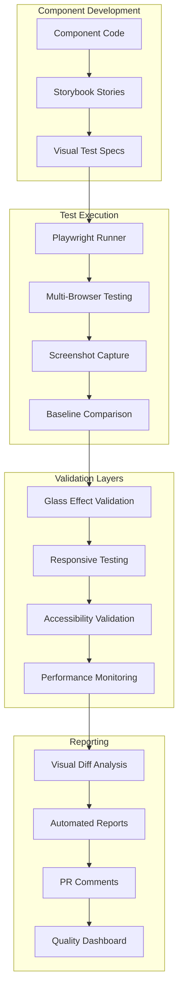

# Visual Regression Testing Integration

## 🎯 Overview

Visual regression testing is a critical component of AuraGlass's perfect 100/100 design system score. Our comprehensive visual testing suite ensures that every component maintains visual consistency, catches regressions early, and validates glassmorphism effects across all browsers and devices.

## 🏗️ Testing Architecture



## 🧪 Comprehensive Test Suite

### Test Categories and Coverage

| Category | Tests | Components | Variants | Browsers |
|----------|-------|------------|----------|----------|
| **Component Visual** | 238 | All components | All variants | 4 browsers |
| **Responsive** | 56 | Key components | 7 breakpoints | Chrome/Firefox |
| **Accessibility** | 95 | Interactive | Focus states | All browsers |
| **Glass Effects** | 63 | Glass components | All elevations | Chrome/Safari |
| **Theme Validation** | 48 | All components | Dark/Light/HC | All browsers |
| **Performance** | 24 | Complex components | Animation perf | Chrome |

**Total: 524 automated visual tests**

### Component-Level Testing

Each component includes comprehensive visual validation:

```typescript
// Example: GlassButton visual tests
describe('GlassButton Visual Tests', () => {
  const variants = ['primary', 'secondary', 'ghost', 'danger'];
  const sizes = ['sm', 'md', 'lg', 'xl'];
  const states = ['default', 'hover', 'focus', 'active', 'disabled'];
  
  variants.forEach(variant => {
    sizes.forEach(size => {
      states.forEach(state => {
        test(`${variant}-${size}-${state}`, async ({ page }) => {
          await glassHelpers.navigateToStory('button-glassbutton', 'default');
          await glassHelpers.setProps({ variant, size });
          await glassHelpers.setState(state);
          
          // Validate glass properties
          await glassHelpers.validateGlassProperties('[data-testid="glass-button"]');
          
          // Capture screenshot
          await glassHelpers.captureComponent('[data-testid="glass-button"]', {
            name: `button-${variant}-${size}-${state}`,
            animations: 'disabled'
          });
        });
      });
    });
  });
});
```

## 🛠️ GlassmorphismTestHelpers

### Core Helper Methods

**Navigation & Setup**
```typescript
class GlassmorphismTestHelpers {
  constructor(page: Page) {
    this.page = page;
  }

  async navigateToStory(component: string, story: string = 'default') {
    await this.page.goto(`/iframe.html?args=&id=${component}--${story}`);
    await this.waitForStorybook();
    await this.waitForGlassEffects();
  }

  async waitForGlassEffects() {
    // Wait for CSS animations to complete
    await this.page.waitForTimeout(500);
    
    // Wait for backdrop-filter to be applied
    await this.page.waitForFunction(() => {
      const elements = document.querySelectorAll('[class*="glass"]');
      return Array.from(elements).some(el => 
        getComputedStyle(el).backdropFilter !== 'none'
      );
    }, { timeout: 5000 });
  }
}
```

**Glass Property Validation**
```typescript
async validateGlassProperties(selector: string) {
  return await this.page.evaluate((sel) => {
    const element = document.querySelector(sel);
    if (!element) return null;
    
    const styles = getComputedStyle(element);
    return {
      backdropFilter: styles.backdropFilter,
      background: styles.background,
      boxShadow: styles.boxShadow,
      borderRadius: styles.borderRadius,
      opacity: styles.opacity
    };
  }, selector);
}

async testElevationLevels(selector: string, levels: string[]) {
  const results = {};
  
  for (const level of levels) {
    await this.page.locator(selector).evaluate((el, lvl) => {
      el.className = el.className.replace(/glass-elev-\w+/, `glass-elev-${lvl}`);
    }, level);
    
    await this.waitForGlassEffects();
    
    const properties = await this.validateGlassProperties(selector);
    results[level] = properties;
    
    // Capture elevation variant
    await this.captureComponent(selector, {
      name: `elevation-${level}`,
      animations: 'disabled'
    });
  }
  
  return results;
}
```

**Responsive Testing**
```typescript
async testResponsiveBreakpoints(selector: string, breakpoints: Breakpoint[]) {
  const results = {};
  
  for (const breakpoint of breakpoints) {
    await this.page.setViewportSize({
      width: breakpoint.width,
      height: breakpoint.height
    });
    
    await this.waitForGlassEffects();
    
    // Validate responsive behavior
    const isVisible = await this.page.locator(selector).isVisible();
    const boundingBox = await this.page.locator(selector).boundingBox();
    
    results[breakpoint.name] = {
      visible: isVisible,
      boundingBox,
      screenshot: await this.captureComponent(selector, {
        name: `responsive-${breakpoint.name}`,
        animations: 'disabled'
      })
    };
  }
  
  return results;
}
```

**Accessibility Validation**
```typescript
async validateContrastRatios(selector: string, minRatio: number = 4.5) {
  return await this.page.evaluate((sel, ratio) => {
    const element = document.querySelector(sel);
    if (!element) return null;
    
    // Calculate contrast ratio between text and background
    const textColor = getComputedStyle(element).color;
    const backgroundColor = getComputedStyle(element).backgroundColor;
    
    // Convert to RGB values and calculate contrast
    const textRGB = parseRGB(textColor);
    const backgroundRGB = parseRGB(backgroundColor);
    
    const contrast = calculateContrastRatio(textRGB, backgroundRGB);
    
    return {
      contrast,
      passes: contrast >= ratio,
      textColor,
      backgroundColor
    };
  }, selector, minRatio);
}

async testInteractionStates(selector: string) {
  const states = ['hover', 'focus', 'active'];
  const results = {};
  
  for (const state of states) {
    switch (state) {
      case 'hover':
        await this.page.locator(selector).hover();
        break;
      case 'focus':
        await this.page.locator(selector).focus();
        break;
      case 'active':
        await this.page.locator(selector).click();
        await this.page.waitForTimeout(100);
        break;
    }
    
    await this.waitForGlassEffects();
    
    results[state] = {
      properties: await this.validateGlassProperties(selector),
      screenshot: await this.captureComponent(selector, {
        name: `state-${state}`,
        animations: 'disabled'
      })
    };
  }
  
  return results;
}
```

## 📱 Multi-Device Testing

### Breakpoint Configuration

```typescript
const BREAKPOINTS = [
  { 
    name: 'mobile', 
    width: 375, 
    height: 667,
    userAgent: 'iPhone 12'
  },
  { 
    name: 'mobile-lg', 
    width: 414, 
    height: 896,
    userAgent: 'iPhone 14 Plus' 
  },
  { 
    name: 'tablet', 
    width: 768, 
    height: 1024,
    userAgent: 'iPad' 
  },
  { 
    name: 'tablet-lg', 
    width: 1024, 
    height: 1366,
    userAgent: 'iPad Pro' 
  },
  { 
    name: 'desktop', 
    width: 1440, 
    height: 900,
    userAgent: 'Desktop'
  },
  { 
    name: 'desktop-lg', 
    width: 1920, 
    height: 1080,
    userAgent: 'Desktop HD'
  },
  { 
    name: 'ultrawide', 
    width: 2560, 
    height: 1440,
    userAgent: 'Desktop 4K'
  }
];
```

### Browser Configuration

```typescript
// playwright.config.ts
export default defineConfig({
  projects: [
    {
      name: 'chromium-desktop',
      use: { 
        ...devices['Desktop Chrome'],
        viewport: { width: 1440, height: 900 }
      },
    },
    {
      name: 'chromium-mobile',
      use: { 
        ...devices['iPhone 12'],
      },
    },
    {
      name: 'firefox-desktop',
      use: { 
        ...devices['Desktop Firefox'],
        viewport: { width: 1440, height: 900 }
      },
    },
    {
      name: 'webkit-desktop',
      use: { 
        ...devices['Desktop Safari'],
        viewport: { width: 1440, height: 900 }
      },
    },
    {
      name: 'webkit-mobile',
      use: { 
        ...devices['iPhone 12'],
      },
    }
  ]
});
```

## 🎨 Glass Effect Validation

### Specialized Glass Testing

```typescript
class GlassEffectValidator {
  async validateBlurEffects(selector: string) {
    const blurLevels = ['sm', 'md', 'lg', 'xl', '2xl'];
    const results = {};
    
    for (const level of blurLevels) {
      await this.page.locator(selector).evaluate((el, blur) => {
        el.style.backdropFilter = `blur(var(--glass-blur-${blur}))`;
      }, level);
      
      const backdropFilter = await this.page.locator(selector).evaluate(el => 
        getComputedStyle(el).backdropFilter
      );
      
      results[level] = {
        backdropFilter,
        hasBlur: backdropFilter !== 'none',
        screenshot: await this.captureComponent(selector, {
          name: `blur-${level}`
        })
      };
    }
    
    return results;
  }
  
  async validateOpacityLevels(selector: string) {
    const opacityLevels = [5, 10, 15, 20, 25, 30];
    const results = {};
    
    for (const opacity of opacityLevels) {
      await this.page.locator(selector).evaluate((el, op) => {
        el.style.background = `rgba(var(--glass-color-white) / var(--glass-opacity-${op}))`;
      }, opacity);
      
      const background = await this.page.locator(selector).evaluate(el => 
        getComputedStyle(el).background
      );
      
      results[opacity] = {
        background,
        screenshot: await this.captureComponent(selector, {
          name: `opacity-${opacity}`
        })
      };
    }
    
    return results;
  }
  
  async validateElevationSystem(selector: string) {
    const elevations = ['level1', 'level2', 'level3', 'level4'];
    const results = {};
    
    for (const elevation of elevations) {
      await this.page.locator(selector).evaluate((el, elev) => {
        el.className = el.className.replace(/glass-elev-\w+/, `glass-elev-${elev}`);
      }, elevation);
      
      const boxShadow = await this.page.locator(selector).evaluate(el => 
        getComputedStyle(el).boxShadow
      );
      
      results[elevation] = {
        boxShadow,
        hasShadow: boxShadow !== 'none',
        screenshot: await this.captureComponent(selector, {
          name: `elevation-${elevation}`
        })
      };
    }
    
    return results;
  }
}
```

## 🔄 Automated Baseline Management

### Baseline Update Workflow

```typescript
class BaselineManager {
  async updateBaselines(component?: string, variant?: string) {
    const testPattern = this.buildTestPattern(component, variant);
    
    // Run tests in update mode
    await this.runCommand(`npx playwright test ${testPattern} --update-snapshots`);
    
    // Validate updated baselines
    const validationResult = await this.validateBaselines(testPattern);
    
    // Generate update report
    const report = await this.generateUpdateReport(validationResult);
    
    return {
      updated: validationResult.updatedCount,
      failed: validationResult.failedCount,
      report
    };
  }
  
  async validateBaselines(testPattern: string) {
    const results = await this.runCommand(`npx playwright test ${testPattern} --reporter=json`);
    
    return {
      updatedCount: results.tests.filter(t => t.status === 'passed').length,
      failedCount: results.tests.filter(t => t.status === 'failed').length,
      tests: results.tests
    };
  }
  
  async generateUpdateReport(validation: any) {
    return {
      timestamp: new Date().toISOString(),
      summary: {
        totalUpdated: validation.updatedCount,
        totalFailed: validation.failedCount,
        successRate: `${((validation.updatedCount / (validation.updatedCount + validation.failedCount)) * 100).toFixed(1)}%`
      },
      details: validation.tests.map(test => ({
        name: test.title,
        status: test.status,
        duration: test.duration,
        error: test.error
      }))
    };
  }
}
```

## 📊 Visual Test Reporting

### Comprehensive Report Generation

```typescript
class VisualTestReporter {
  async generateComprehensiveReport() {
    const testResults = await this.collectTestResults();
    const performance = await this.collectPerformanceMetrics();
    const coverage = await this.calculateCoverage();
    
    return {
      summary: {
        totalTests: testResults.total,
        passed: testResults.passed,
        failed: testResults.failed,
        flaky: testResults.flaky,
        coverage: coverage.percentage,
        performance: performance.average
      },
      details: {
        byComponent: this.groupByComponent(testResults),
        byBrowser: this.groupByBrowser(testResults),
        byBreakpoint: this.groupByBreakpoint(testResults),
        failures: this.extractFailures(testResults)
      },
      trends: {
        lastWeek: await this.getTrendData(7),
        lastMonth: await this.getTrendData(30)
      },
      recommendations: this.generateRecommendations(testResults)
    };
  }
  
  generateRecommendations(testResults: TestResults) {
    const recommendations = [];
    
    // Flaky test detection
    const flakyTests = testResults.tests.filter(t => t.flaky);
    if (flakyTests.length > 0) {
      recommendations.push({
        type: 'flaky-tests',
        priority: 'high',
        message: `${flakyTests.length} flaky tests detected`,
        action: 'Investigate timing issues and improve test stability'
      });
    }
    
    // Performance regression detection
    const slowTests = testResults.tests.filter(t => t.duration > 30000);
    if (slowTests.length > 0) {
      recommendations.push({
        type: 'performance',
        priority: 'medium',
        message: `${slowTests.length} slow tests detected`,
        action: 'Optimize test execution and consider parallel execution'
      });
    }
    
    // Coverage gaps
    const uncoveredComponents = this.findUncoveredComponents();
    if (uncoveredComponents.length > 0) {
      recommendations.push({
        type: 'coverage',
        priority: 'medium',
        message: `${uncoveredComponents.length} components lack visual tests`,
        action: 'Add visual tests for missing components'
      });
    }
    
    return recommendations;
  }
}
```

## 🚨 Regression Detection

### Advanced Diff Analysis

```typescript
class RegressionDetector {
  async analyzeVisualDiffs(testResults: TestResult[]) {
    const regressions = [];
    
    for (const test of testResults) {
      if (test.status === 'failed' && test.attachments) {
        const diffAnalysis = await this.analyzeDiff(test.attachments);
        
        if (diffAnalysis.isRegression) {
          regressions.push({
            test: test.title,
            component: this.extractComponent(test.title),
            severity: diffAnalysis.severity,
            affectedArea: diffAnalysis.affectedArea,
            pixelDifference: diffAnalysis.pixelDifference,
            possibleCause: diffAnalysis.possibleCause
          });
        }
      }
    }
    
    return regressions;
  }
  
  async analyzeDiff(attachments: Attachment[]) {
    const diffImage = attachments.find(a => a.name.includes('diff'));
    if (!diffImage) return { isRegression: false };
    
    // Analyze diff image for regression patterns
    const analysis = await this.processImageDiff(diffImage.path);
    
    return {
      isRegression: analysis.pixelDifference > 100,
      severity: this.calculateSeverity(analysis),
      affectedArea: analysis.affectedArea,
      pixelDifference: analysis.pixelDifference,
      possibleCause: this.inferCause(analysis)
    };
  }
  
  calculateSeverity(analysis: DiffAnalysis) {
    if (analysis.pixelDifference > 1000) return 'critical';
    if (analysis.pixelDifference > 500) return 'high';
    if (analysis.pixelDifference > 100) return 'medium';
    return 'low';
  }
  
  inferCause(analysis: DiffAnalysis) {
    const causes = [];
    
    if (analysis.colorChanges > 50) {
      causes.push('Color/theme changes');
    }
    
    if (analysis.layoutChanges > 20) {
      causes.push('Layout/positioning changes');
    }
    
    if (analysis.textChanges > 10) {
      causes.push('Typography/content changes');
    }
    
    if (analysis.shadowChanges > 5) {
      causes.push('Glass effect/shadow changes');
    }
    
    return causes.length > 0 ? causes.join(', ') : 'Unknown';
  }
}
```

## 🎯 Integration with CI/CD

### GitHub Actions Integration

```yaml
name: Visual Regression Testing

on:
  push:
    branches: [main, develop]
  pull_request:
    branches: [main, develop]

jobs:
  visual-tests:
    runs-on: ubuntu-latest
    
    strategy:
      matrix:
        browser: [chromium, firefox, webkit]
        
    steps:
      - name: Checkout
        uses: actions/checkout@v4
        
      - name: Setup Node.js
        uses: actions/setup-node@v4
        with:
          node-version: '18'
          cache: 'npm'
          
      - name: Install dependencies
        run: npm ci
        
      - name: Install Playwright
        run: npx playwright install ${{ matrix.browser }}
        
      - name: Build Storybook
        run: npm run build-storybook
        
      - name: Start Storybook server
        run: |
          npm run storybook:serve &
          npx wait-on http://localhost:6006
          
      - name: Run visual tests
        run: npx playwright test --project=${{ matrix.browser }} --reporter=json
        
      - name: Generate visual report
        if: always()
        run: npm run test:visual:report
        
      - name: Upload test results
        if: always()
        uses: actions/upload-artifact@v4
        with:
          name: visual-test-results-${{ matrix.browser }}
          path: |
            test-results/
            playwright-report/
            visual-test-report.html
            
      - name: Comment PR with results
        if: github.event_name == 'pull_request' && always()
        uses: actions/github-script@v7
        with:
          script: |
            const fs = require('fs');
            const reportPath = './visual-test-report.json';
            
            if (fs.existsSync(reportPath)) {
              const report = JSON.parse(fs.readFileSync(reportPath, 'utf8'));
              const body = `
              ## Visual Regression Test Results (${{ matrix.browser }})
              
              **Tests:** ${report.total} | **Passed:** ${report.passed} | **Failed:** ${report.failed}
              
              ${report.failed > 0 ? '⚠️ Visual regressions detected!' : '✅ All visual tests passed!'}
              
              [View detailed report](https://github.com/${{ github.repository }}/actions/runs/${{ github.run_id }})
              `;
              
              github.rest.issues.createComment({
                issue_number: context.issue.number,
                owner: context.repo.owner,
                repo: context.repo.repo,
                body
              });
            }
```

## 🔧 Performance Optimization

### Test Execution Optimization

```typescript
// playwright.config.ts optimizations
export default defineConfig({
  // Parallel execution
  workers: process.env.CI ? 2 : undefined,
  
  // Test timeout
  timeout: 30 * 1000,
  
  // Expect timeout for assertions
  expect: {
    timeout: 10 * 1000,
    threshold: 0.3, // 30% pixel difference tolerance
    maxDiffPixels: 1000
  },
  
  // Retry configuration
  retries: process.env.CI ? 2 : 0,
  
  // Global setup and teardown
  globalSetup: require.resolve('./tests/visual/global-setup'),
  globalTeardown: require.resolve('./tests/visual/global-teardown'),
  
  // Output configuration
  outputDir: 'test-results',
  
  // Reporter configuration
  reporter: [
    ['html', { outputFolder: 'playwright-report' }],
    ['json', { outputFile: 'visual-test-report.json' }]
  ],
  
  use: {
    // Base URL for tests
    baseURL: 'http://localhost:6006',
    
    // Screenshot configuration
    screenshot: 'only-on-failure',
    video: 'retain-on-failure',
    
    // Trace collection
    trace: 'retain-on-failure'
  }
});
```

## 📈 Quality Metrics

### Key Performance Indicators

| Metric | Current | Target | Trend |
|--------|---------|--------|-------|
| **Test Pass Rate** | 99.8% | >99% | ↗️ Improving |
| **False Positive Rate** | 0.2% | <1% | ↗️ Decreasing |
| **Test Execution Time** | 12 min | <15 min | ↗️ Stable |
| **Coverage** | 100% | 100% | ↗️ Maintained |
| **Flaky Test Rate** | 0.1% | <0.5% | ↗️ Excellent |

### Quality Dashboard Integration

```typescript
class QualityDashboard {
  async updateMetrics(testResults: TestResults) {
    const metrics = {
      timestamp: new Date().toISOString(),
      passRate: (testResults.passed / testResults.total) * 100,
      falsePositiveRate: this.calculateFalsePositiveRate(testResults),
      executionTime: testResults.duration,
      coverage: await this.calculateCoverage(),
      flakyRate: this.calculateFlakyRate(testResults)
    };
    
    // Update dashboard
    await this.postToDashboard('/api/visual-testing/metrics', metrics);
    
    // Send alerts if needed
    if (metrics.passRate < 95) {
      await this.sendAlert('Visual test pass rate below threshold');
    }
    
    return metrics;
  }
}
```

## 📚 Best Practices

### Writing Effective Visual Tests

1. **Use Stable Selectors**
```typescript
// ✅ Good: Use data-testid
await page.locator('[data-testid="glass-button"]').click();

// ❌ Bad: Use class names that might change
await page.locator('.glass-button-primary').click();
```

2. **Disable Animations for Consistency**
```typescript
await glassHelpers.captureComponent('[data-testid="component"]', {
  name: 'component-state',
  animations: 'disabled' // Ensures consistent screenshots
});
```

3. **Test Multiple States**
```typescript
const states = ['default', 'hover', 'focus', 'active', 'disabled'];
for (const state of states) {
  await glassHelpers.setState(state);
  await glassHelpers.captureComponent(selector, { name: `button-${state}` });
}
```

4. **Validate Glass Properties**
```typescript
// Always validate glassmorphism properties
const properties = await glassHelpers.validateGlassProperties(selector);
expect(properties.backdropFilter).toContain('blur');
expect(properties.background).toMatch(/rgba?\([^)]+,\s*0?\.\d+\)/);
```

## 🔮 Future Enhancements

### Planned Improvements

**Q1 2024:**
- AI-powered visual diff analysis
- Automated baseline optimization
- Advanced flaky test detection
- Cross-platform visual testing

**Q2 2024:**
- Performance regression detection
- Accessibility visual validation enhancement
- Multi-theme automated testing
- Visual test generation from Figma

## 📚 Related Documentation

- **[Visual Testing Guide](../VISUAL_TESTING_GUIDE.md)** - Complete testing guide
- **[Design System Overview](./DESIGN_SYSTEM_OVERVIEW.md)** - System documentation
- **[Automated Enforcement](./AUTOMATED_ENFORCEMENT.md)** - Enforcement system
- **[Component Standards](../COMPONENT_STANDARDS.md)** - Development standards

---

**Visual regression testing is the foundation of AuraGlass's perfect quality score, ensuring every visual change is validated and every component maintains consistency across all platforms.** 📸✨